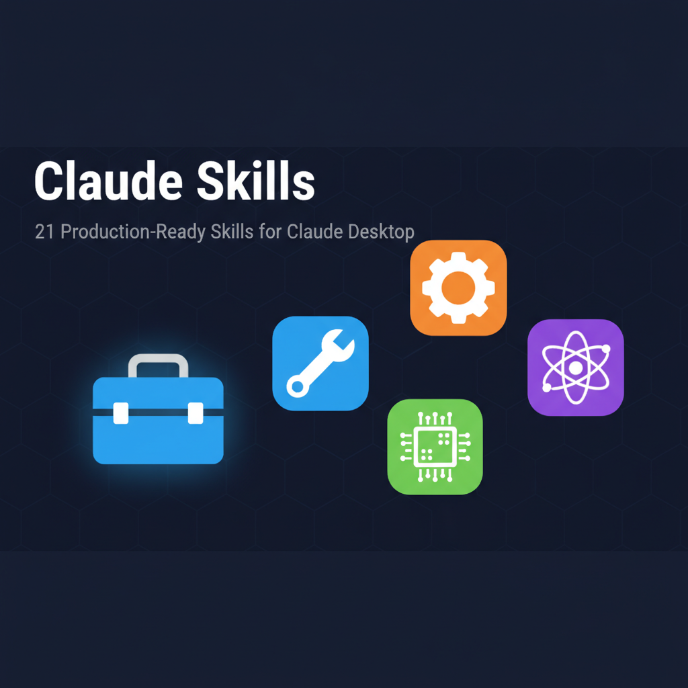

<p align="center">
  
</p>

<h3 align="center">21 production-ready skills for Claude Desktop across Career, Creator, Growth, and Developer domains + Marketing Agents plugin</h3>

<p align="center">
  <a href="#quick-start">Quick Start</a> &bull;
  <a href="#skill-suites">Skill Suites</a> &bull;
  <a href="#examples">Examples</a> &bull;
  <a href="#contributing">Contributing</a>
</p>

---

## What is this?

A collection of 21 Claude Desktop skills that handle common writing and content tasks. Each skill is a `.skill` file you upload to a Claude Desktop project. Once loaded, Claude automatically picks the right skill based on what you ask for -- no special commands needed.

```
You:    Help me write resume bullets for my data analyst role
Claude: [uses resume-bullet-generator skill]
        - Led cross-functional analysis of customer churn patterns across
          3 product lines, reducing monthly churn rate from 8.2% to 5.1%
        - Built automated reporting pipeline processing 2M+ daily records,
          cutting report generation time from 4 hours to 12 minutes
```

The skills are organized into four suites:

| Suite | Skills | What it covers |
|-------|--------|---------------|
| **Career** | 6 | Resumes, cover letters, bios, email tone, job descriptions, LinkedIn posts |
| **Creator** | 6 | Instagram captions, YouTube scripts, tweet threads, blog outlines, meta descriptions, podcast notes |
| **Growth** | 5 | Product descriptions, meeting summaries, Google Ads copy, cold emails, subject lines |
| **Specialized** | 4 | Amazon reviews, legal doc simplification, technical doc simplification, MCP server design |

## Quick start

1. Clone this repo:
```bash
git clone https://github.com/m2ai-portfolio/claude-skills.git
```

2. Go to [claude.ai](https://claude.ai) and create a project (or use an existing one)

3. Click **Skills** > **Upload skill** and select the `.skill` files you want

4. Start chatting. Claude matches your request to the right skill automatically:
```
"Help me write resume bullets for my data analyst role"
"Write an Instagram caption for my product launch carousel"
"Summarize this meeting transcript with action items"
"Design an MCP server that connects to Notion"
```

No need to reference skill names. Just describe what you need.

## Skill suites

### Career Suite

| Skill | What it does |
|-------|-------------|
| `resume-bullet-generator` | Turns job duties into achievement-focused, ATS-optimized bullets |
| `cover-letter-personalizer` | Writes targeted cover letters matched to specific job postings |
| `social-media-bio-writer` | Creates platform-specific bios for LinkedIn, X, Instagram, TikTok |
| `email-tone-converter` | Rewrites emails to match any tone (formal, friendly, urgent, etc.) |
| `job-description-generator` | Produces clear, unbiased job postings |
| `linkedin-post-formatter` | Formats posts for LinkedIn's algorithm and engagement patterns |

### Creator Suite

| Skill | What it does |
|-------|-------------|
| `instagram-caption-generator` | Writes captions with hooks, CTAs, and hashtag strategies |
| `youtube-script-outliner` | Builds retention-optimized video structures |
| `tweet-thread-generator` | Creates narrative-driven Twitter/X threads |
| `blog-post-outline-creator` | Produces SEO-friendly content structures |
| `meta-description-generator` | Writes click-worthy search result snippets |
| `podcast-show-notes-generator` | Generates episode summaries with timestamps |

### Growth Suite

| Skill | What it does |
|-------|-------------|
| `product-description-writer` | Writes e-commerce copy in short/medium/long formats |
| `meeting-summary-generator` | Extracts action items and decisions from transcripts |
| `google-ads-copy-generator` | Creates compliant ad copy within character limits |
| `cold-email-personalizer` | Writes personalized outreach based on prospect research |
| `email-subject-line-generator` | Generates high-open-rate subject lines with A/B variants |

### Specialized Tools

| Skill | What it does |
|-------|-------------|
| `amazon-product-review-generator` | Provides compliant review guidance and templates |
| `legal-document-simplifier` | Translates contracts into plain-language summaries |
| `technical-document-simplifier` | Rewrites API docs for non-technical audiences |
| `mcp-forge` | Walks you through designing a production-ready MCP server PRD |

## Examples

**Resume Bullet Generator**

```
Input:  "I managed a team of 5 developers working on a web application"

Output: - Led cross-functional development team of 5 engineers, delivering
          customer-facing web application 2 weeks ahead of schedule
        - Established agile workflows and daily standups, improving sprint
          completion rate from 67% to 94%
```

**Cold Email Personalizer**

```
Input:  Prospect: Sarah Chen, VP Product at TechCorp
        Recent: Just announced Series B funding
        Offer: AI workflow automation consulting

Output: Subject: Congrats on TechCorp's Series B - Scaling Product Operations

        Hi Sarah,

        Saw TechCorp's Series B announcement - congrats! Growing from 50
        to 150 people is exciting, but product ops complexity grows
        exponentially...
```

**Instagram Caption Generator**

```
Input:  Post type: Carousel | Topic: Morning productivity routine
        Audience: Entrepreneurs, 25-35 | Tone: Motivational

Output: Your morning sets the tone for your entire day.
        Here's the 5-step routine that transformed mine...

        (Swipe to see each step with actionable tips)

        #ProductivityHacks #MorningRoutine #EntrepreneurLife
```

## File structure

```
claude-skills/
  resume-bullet-generator.skill
  cover-letter-personalizer.skill
  instagram-caption-generator.skill
  ... (21 .skill files total)
  mcp-forge/             # MCP server design wizard (multi-file skill)
  docs/
    SKILL_CATALOG.md     # Full trigger patterns and examples
    QUICK_START.md       # Upload instructions
    DEVELOPMENT.md       # Skill creation guidelines
```

## Automation

These skills pair well with n8n workflows for hands-free automation:

```
New Zoom recording
  -> Extract transcript via Zoom API
  -> Claude + meeting-summary-generator skill
  -> Post summary to Slack
  -> Create tasks in Asana with owners and deadlines
```

## Contributing

Found an issue or want to improve a skill?

1. Fork the repo
2. Edit the `.skill` file
3. Test with real use cases
4. Submit a PR with before/after examples

See [docs/DEVELOPMENT.md](docs/DEVELOPMENT.md) for skill creation guidelines.

## License

MIT

## Author

Matthew Snow -- [M2AI](https://m2ai.co) | [@m2ai-portfolio](https://github.com/m2ai-portfolio)
